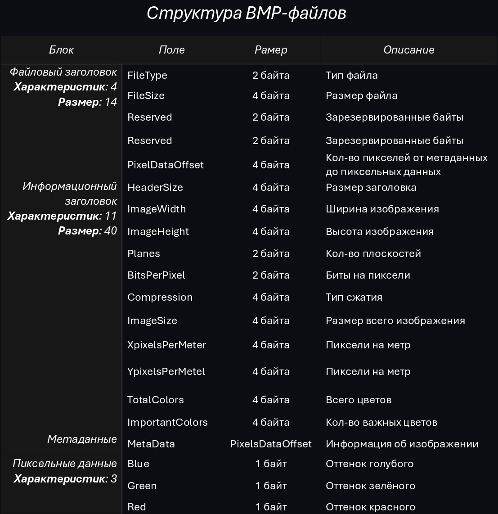

# **Автоматизация рутинных задач**

В мире, в котором мы живём, учимся, работаем, многие стремятся добиться автоматизации, облегчения рутинной работы, что достигается в большинстве благодаря компьютерным программам🤖. Люди, на своём подобии, в стремлении к автоматизации рутинных задач, придумали математическое строение нейронной сети, которое повседневно используется в разных сферах, от подбора рекомендаций видео в _VK видео_ до расчётов и анализов космических кораблей.

###### Работа с изображениями

Для реализации обучения нейронной сети, а также использования готового продукта, требуется модуль, для чтения и обработки изображений. В данном проекте, был написан `image_utils` модуль для работы с изображениями. Он поддерживает функции чтения, масштабирования, рисования, сохранения и представления изображения в чёрно-белом виде. Описание каждой функции модуля ниже👇

`load` - 
функция для чтения изображения. Функция читает только bmp файлы, а поэтому на вход поступает имя файла, с помощью которого программа, используя терминал (через `os.system`), преобразует любой формат изображения в bmp (при условии, если файл токовым не является). После этого, следует узнать размеры изображения, которые можно узнать, зная структуру bmp файлов:

Из изображения достаём: 
`ImageWidth` - ширина изображения (с 18 по 22 байты) 
`ImageHeight` - высота изображения (с 22 по 26 байты) 
`PixelDataOffset` - длина от метаданных до пиксельных данных (с 10 по 14 байты)

Нужно помнить что длина каждой строки изображения должна быть кратна 4, поэтому была введена переменная `row_size`, которая равна: `(width * 3 + 3) // 4 * 4`, данное выражение делает строку кратной 4 в большую сторону, для избежания обреза изображения. Также стоит отметить что строки хранятся в обратном порядке, соответственно запись перебора строк будет выглядеть следующим образом: `range(self.height - 1, -1, -1)`. Пиксели также помещены в BMP-файле в обратном порядке (вместо RGB - BGR).

Зная все аспекты данных в изображении, запись пикселей имеет вид:   \[\[\(B, G, R), (B, G, R)],  \[\(B, G, R), (B, G, R)],  \[\(B, G, R), (B, G, R)]]. 

